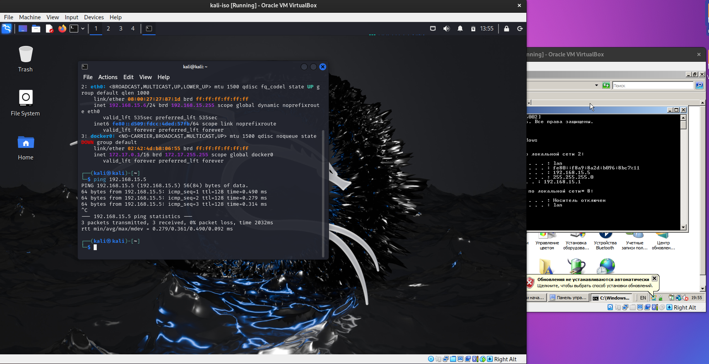
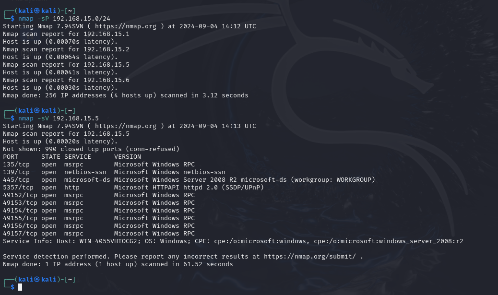

# Metasploit simple case

Homework for SF/MIFI infosec courses

## Step one, setting up the environment

Configuring network for virtualbox machines
```bash
vboxmanage natnetwork add --netname mynet --network "192.168.15.0/24" --enable --dhcp on

# kali
$VM_NAME='kali-iso'
vboxmanage modifyvm $VM_NAME --nic1 natnetwork --nat-network1 mynet

# and the same for server
$VM_NAME='w2008'
vboxmanage modifyvm $VM_NAME --nic1 natnetwork --nat-network1 mynet
```

Checking that Kali can see w2008 server


## Step two, disabling antivirus (as required by [task](the_task.md))


## Step three, nmap



Open 445 port found!
